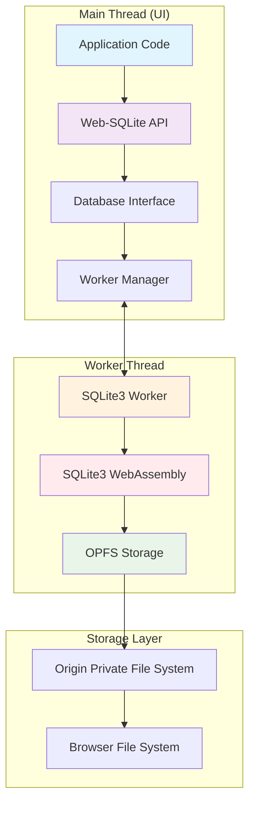
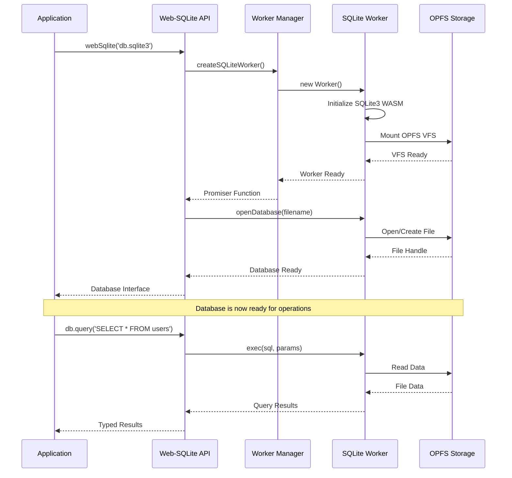
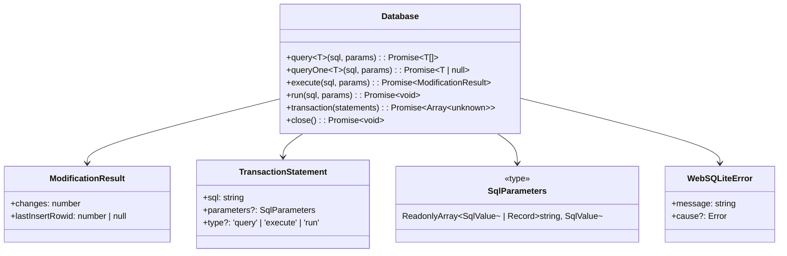
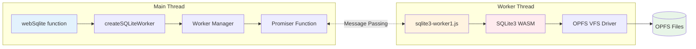
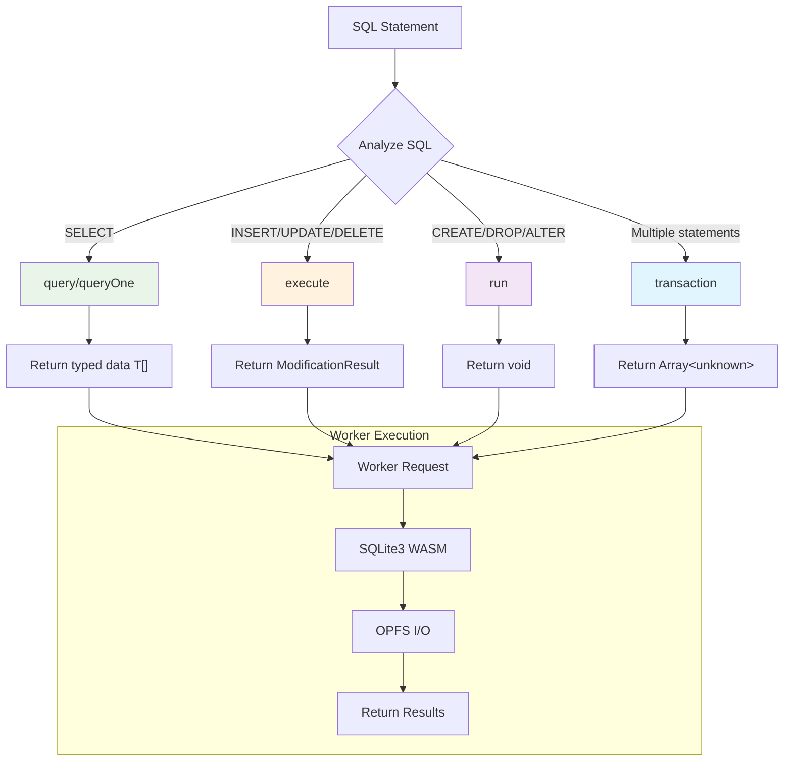
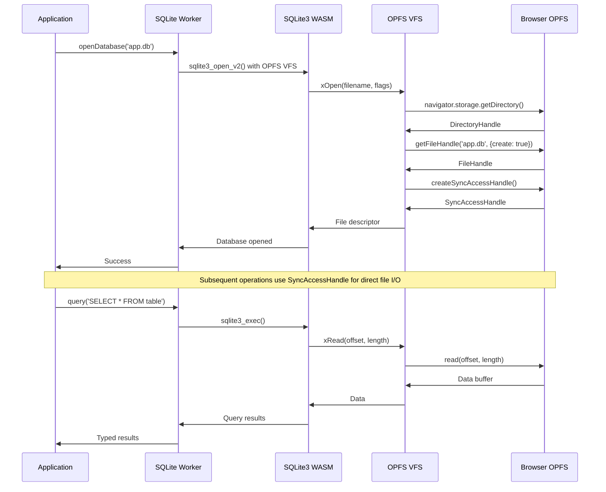
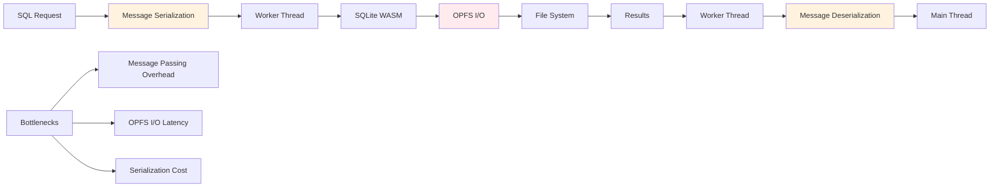
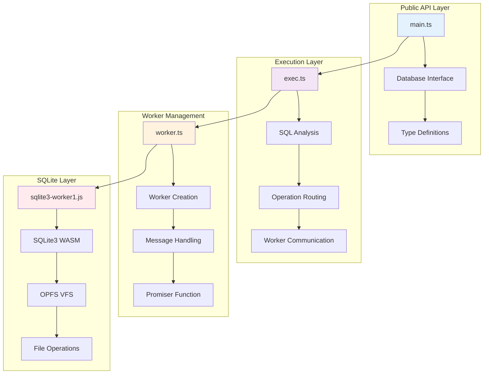

A TypeScript-first runtime library for SQLite WebAssembly with OPFS persistence and functional API.

## Features

- 🎯 **Type-Safe API**: 6 specialized methods for different database operations
- 🗃️ **OPFS Persistence**: Reliable storage via Origin Private File System
- ⚡ **Worker-Based**: Non-blocking execution using Web Workers
- 🔧 **TypeScript**: Full TypeScript support with excellent type inference
- 🎨 **Functional**: Pure functions, immutable data, composable operations
- 📦 **Self-Contained**: No runtime dependencies

## Architecture Overview

Web-SQLite uses a multi-threaded architecture with clear separation between the main thread (UI) and worker thread (database operations). This design ensures non-blocking database operations while providing a type-safe API.



### Communication Flow



### Type-Safe API Design



## Browser Support

| Feature             | Chrome | Safari | Edge | Notes                    |
| ------------------- | ------ | ------ | ---- | ------------------------ |
| **Minimum Version** | 86+    | 15.2+  | 86+  | OPFS + Workers required  |
| Web Workers         | ✅     | ✅     | ✅   | Required for execution   |
| OPFS                | ✅     | ✅     | ✅   | Required for persistence |
| WebAssembly         | ✅     | ✅     | ✅   | SQLite runtime           |

**Note:** Firefox is not supported due to lack of OPFS.

## Installation

```bash
npm install web-sqlite
# or
pnpm add web-sqlite
# or
yarn add web-sqlite
```

## Quick Start

```typescript
import webSqlite from "web-sqlite";

// Open database with OPFS persistence
const db = await webSqlite("my-app.sqlite3");

// Create table using run() for DDL operations
await db.run(`
  CREATE TABLE users (
    id INTEGER PRIMARY KEY AUTOINCREMENT,
    name TEXT NOT NULL,
    email TEXT UNIQUE
  )
`);

// Insert data using execute() for modifications
const result = await db.execute(
    "INSERT INTO users (name, email) VALUES (?, ?)",
    ["John Doe", "john@example.com"],
);
console.log(`Inserted user with ID: ${result.lastInsertRowid}`);

// Insert with named parameters
await db.execute("INSERT INTO users (name, email) VALUES ($name, $email)", {
    name: "Jane Smith",
    email: "jane@example.com",
});

// Query data with type safety using query()
type User = { id: number; name: string; email: string };
const users = await db.query<User>("SELECT * FROM users");
console.log(`Found ${users.length} users`);

// Get single user with queryOne()
const user = await db.queryOne<User>("SELECT * FROM users WHERE id = ?", [1]);
if (user) {
    console.log(`User: ${user.name}`);
}

// Use transactions for atomic operations
await db.transaction([
    {
        sql: "INSERT INTO users (name, email) VALUES (?, ?)",
        parameters: ["Alice", "alice@example.com"],
        type: "execute",
    },
    {
        sql: "UPDATE users SET name = ? WHERE id = ?",
        parameters: ["Alice Johnson", 1],
        type: "execute",
    },
]);

// Close database
await db.close();
```

## API Reference

### `webSqlite(filename: string): Promise<Database>`

Opens a SQLite database with OPFS persistence.

- **filename**: Name of the database file (stored in OPFS)
- **Returns**: Promise resolving to Database interface with type-safe methods

### Database Interface Methods

#### `Database.query<T>(sql: string, parameters?: SqlParameters): Promise<T[]>`

Execute SELECT queries and return typed results as arrays.

- **sql**: SELECT statement
- **parameters**: Optional parameters (array for positional, object for named)
- **Returns**: Promise resolving to array of rows matching type T

```typescript
interface User {
    id: number;
    name: string;
}
const users = await db.query<User>(
    "SELECT id, name FROM users WHERE active = ?",
    [true],
);
```

#### `Database.queryOne<T>(sql: string, parameters?: SqlParameters): Promise<T | null>`

Execute a SELECT query and return the first row.

- **sql**: SELECT statement
- **parameters**: Optional parameters
- **Returns**: Promise resolving to first row or null if no results

```typescript
const user = await db.queryOne<User>("SELECT * FROM users WHERE id = ?", [1]);
if (user) console.log(user.name);
```

#### `Database.execute(sql: string, parameters?: SqlParameters): Promise<ModificationResult>`

Execute INSERT, UPDATE, DELETE statements.

- **sql**: Data modification statement (INSERT, UPDATE, DELETE)
- **parameters**: Optional parameters
- **Returns**: Promise resolving to modification result with change count and insert ID

```typescript
const result = await db.execute("INSERT INTO users (name) VALUES (?)", [
    "John",
]);
console.log(`Inserted ${result.changes} rows, ID: ${result.lastInsertRowid}`);
```

#### `Database.run(sql: string, parameters?: SqlParameters): Promise<void>`

Execute DDL statements (CREATE, DROP, ALTER, etc.) and utility operations.

- **sql**: DDL or utility statement
- **parameters**: Optional parameters
- **Returns**: Promise resolving to void

```typescript
await db.run("CREATE TABLE users (id INTEGER PRIMARY KEY, name TEXT)");
await db.run("CREATE INDEX idx_users_name ON users(name)");
```

#### `Database.transaction(statements: TransactionStatement[]): Promise<Array<unknown>>`

Execute multiple statements in a transaction atomically.

- **statements**: Array of statements with optional parameters and types
- **Returns**: Promise resolving to array of results from each statement

```typescript
const results = await db.transaction([
    {
        sql: "INSERT INTO users (name) VALUES (?)",
        parameters: ["Alice"],
        type: "execute",
    },
    { sql: "SELECT COUNT(*) as count FROM users", type: "query" },
]);
```

#### `Database.close(): Promise<void>`

Close the database connection and cleanup resources.

```typescript
await db.close();
```

### Types

```typescript
interface ModificationResult {
    changes: number;
    lastInsertRowid: number | null;
}

interface TransactionStatement {
    sql: string;
    parameters?: SqlParameters;
    type?: "query" | "execute" | "run";
}

type SqlParameters =
    | ReadonlyArray<SqlValue>
    | Readonly<Record<string, SqlValue>>;
type SqlValue =
    | string
    | number
    | bigint
    | boolean
    | null
    | Uint8Array
    | ArrayBufferView
    | Date;
```

## Internal Architecture

### Worker Thread Management



### SQL Operation Routing



### OPFS Integration Details



## Important Notes

### Security Headers Required

Web-SQLite's OPFS functionality requires specific security headers for SharedArrayBuffer support:

```
Cross-Origin-Embedder-Policy: require-corp
Cross-Origin-Opener-Policy: same-origin
```

These headers enable cross-origin isolation, which is required for OPFS persistence.

### Browser Support

- Chrome 86+
- Safari 15.2+
- Edge 86+

**Note:** Firefox is not supported due to lack of OPFS.

### Performance Characteristics



**Performance Tips:**

- Use transactions for bulk operations
- Minimize message passing with batch operations
- OPFS provides near-native file I/O performance
- Worker thread prevents UI blocking

## Development

### Library Structure



### Running Examples

1. Build the project:

    ```bash
    pnpm build
    ```

2. Start the example server with required security headers:

    ```bash
    pnpm start:examples
    ```

3. Open http://localhost:7411/examples/ in Chrome 86+ or Safari 15.2+

The examples demonstrate:

- All 6 API methods with type safety
- OPFS persistence across page reloads
- Transaction handling
- Error management
- Browser feature detection

### Building from Source

```bash
# Install dependencies
pnpm install

# Build the library
pnpm build

# Watch mode for development
pnpm build:dev
```

## License

MIT © wuchuheng
