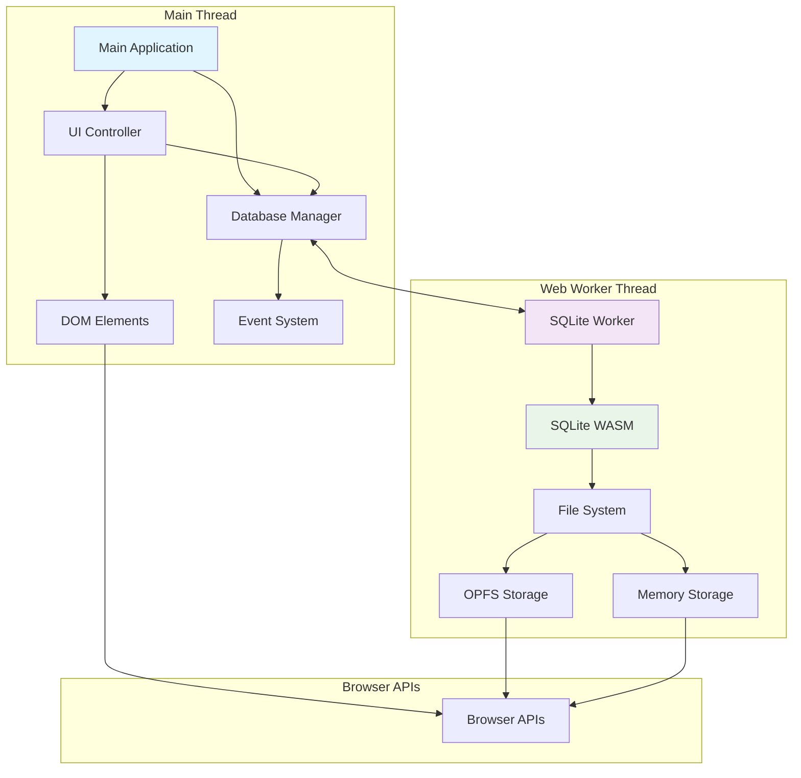
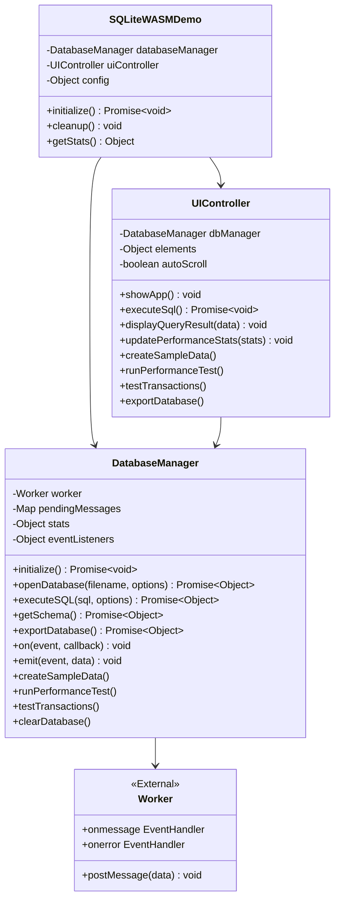
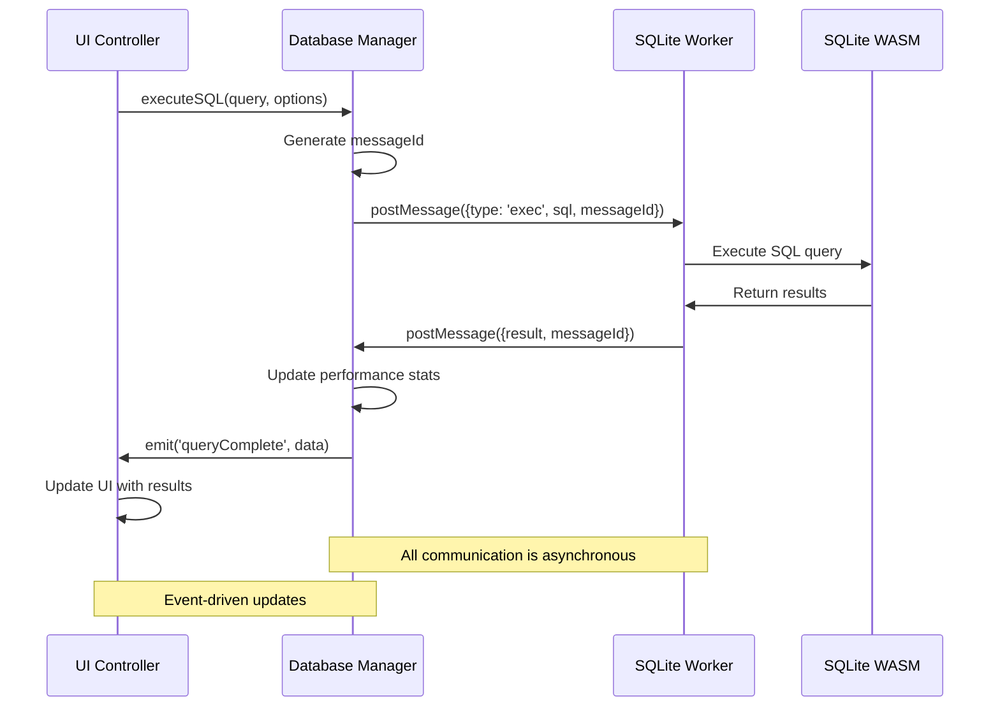

# SQLite WASM API Documentation

A comprehensive guide to using SQLite WebAssembly with the provided API wrapper.

## Table of Contents

1. [Overview](#overview)
2. [Architecture](#architecture)
3. [API Reference](#api-reference)
4. [Usage Examples](#usage-examples)
5. [Advanced Features](#advanced-features)
6. [Best Practices](#best-practices)
7. [Troubleshooting](#troubleshooting)

## Overview

This SQLite WASM implementation provides a powerful, browser-native database solution with the following key features:

-   **Web Worker Integration**: Non-blocking database operations
-   **Full SQLite Support**: Complete SQL syntax including joins, transactions, triggers
-   **Multiple Storage Options**: In-memory, OPFS (Origin Private File System)
-   **Performance Monitoring**: Built-in query performance tracking
-   **Event-Driven Architecture**: Reactive programming with custom events
-   **Promise-Based API**: Modern async/await support

## Architecture

### System Architecture Diagram



### Class Relationship Diagram



### Data Flow Diagram



## API Reference

### DatabaseManager Class

The core class that handles all SQLite operations through a Web Worker.

#### Constructor

```javascript
const dbManager = new DatabaseManager();
```

#### Methods

##### `initialize(): Promise<void>`

Initializes the SQLite WASM worker and prepares for database operations.

```javascript
await dbManager.initialize();
```

**Throws**: `Error` if worker fails to initialize

##### `openDatabase(filename, options): Promise<Object>`

Opens a database connection with the specified filename and options.

```javascript
const result = await dbManager.openDatabase("myapp.db", {
    vfs: "opfs", // or 'memdb' for in-memory
    flags: "ct", // create if not exists
});

// Returns:
// {
//     dbId: 'db#1@12345',
//     filename: 'myapp.db',
//     vfs: 'opfs'
// }
```

**Parameters**:

-   `filename` (string): Database filename or ':memory:' for in-memory
-   `options` (Object, optional):
    -   `vfs` (string): Virtual file system ('opfs', 'memdb')
    -   `flags` (string): Open flags ('c'=create, 't'=truncate, 'r'=readonly)

**Returns**: `Promise<Object>` - Database connection info

##### `executeSQL(sql, options): Promise<Object>`

Executes SQL commands and returns results.

```javascript
// Basic query
const result = await dbManager.executeSQL("SELECT * FROM users");

// With options
const result = await dbManager.executeSQL("SELECT * FROM users WHERE age > ?", {
    bind: [25], // Parameter binding
    rowMode: "object", // 'array', 'object', 'stmt'
    resultRows: [], // Collect all rows
    columnNames: [], // Collect column names
});

// Result structure:
// {
//     resultRows: [...],       // Query results
//     columnNames: [...],      // Column names
//     changeCount: 0,          // Rows affected (INSERT/UPDATE/DELETE)
//     lastInsertRowId: 123     // Last inserted row ID
// }
```

**Parameters**:

-   `sql` (string): SQL command(s) to execute
-   `options` (Object, optional):
    -   `bind` (Array|Object): Parameter values for ? or $name placeholders
    -   `rowMode` (string): Result format ('array', 'object', 'stmt', number)
    -   `resultRows` (Array): Array to collect result rows
    -   `columnNames` (Array): Array to collect column names
    -   `callback` (Function): Row-by-row processing callback

**Returns**: `Promise<Object>` - Query execution results

##### `getSchema(): Promise<Object>`

Retrieves database schema information including tables, indexes, and views.

```javascript
const schema = await dbManager.getSchema();

// Returns:
// {
//     table: [
//         {
//             name: 'users',
//             sql: 'CREATE TABLE users(...)',
//             columns: [
//                 {
//                     name: 'id',
//                     type: 'INTEGER',
//                     notnull: true,
//                     primaryKey: true,
//                     defaultValue: null
//                 },
//                 // ... more columns
//             ]
//         }
//     ],
//     index: [...],
//     view: [...]
// }
```

**Returns**: `Promise<Object>` - Schema information organized by type

##### `createSampleData(): Promise<void>`

Creates sample tables with test data for demonstration purposes.

```javascript
await dbManager.createSampleData();
```

Creates:

-   `users` table with sample user records
-   `posts` table with sample posts
-   Indexes on email and foreign keys

##### `runPerformanceTest(): Promise<Object>`

Runs a comprehensive performance test with bulk operations.

```javascript
const perfResults = await dbManager.runPerformanceTest();

// Returns:
// {
//     totalTime: '1234.56',
//     insertTime: '123.45',
//     selectTime: '12.34',
//     complexTime: '56.78',
//     recordsProcessed: 1000,
//     throughput: '812'
// }
```

**Returns**: `Promise<Object>` - Performance metrics

##### `testTransactions(): Promise<Object>`

Tests transaction functionality with commit and rollback scenarios.

```javascript
const transactionResults = await dbManager.testTransactions();

// Returns:
// {
//     commitTest: true,    // Transaction commit successful
//     rollbackTest: true   // Transaction rollback successful
// }
```

**Returns**: `Promise<Object>` - Transaction test results

##### `exportDatabase(): Promise<Object>`

Exports the current database to a downloadable file.

```javascript
const exportData = await dbManager.exportDatabase();

// Returns:
// {
//     filename: 'export.sqlite3',
//     byteArray: Uint8Array(...),
//     mimetype: 'application/x-sqlite3'
// }
```

**Returns**: `Promise<Object>` - Export data for download

##### `clearDatabase(): Promise<void>`

Drops all user tables from the database.

```javascript
await dbManager.clearDatabase();
```

##### `getStats(): Object`

Returns current performance statistics.

```javascript
const stats = dbManager.getStats();

// Returns:
// {
//     totalQueries: 42,
//     totalTime: 1234.56,
//     lastQueryTime: 23.45,
//     rowsAffected: 5,
//     avgTime: 29.39
// }
```

**Returns**: `Object` - Performance statistics

#### Event System

The DatabaseManager uses an event-driven architecture for reactive programming.

##### `on(event, callback): void`

Registers an event listener.

```javascript
dbManager.on("connect", (data) => {
    console.log("Database connected:", data.filename);
});

dbManager.on("queryComplete", (data) => {
    console.log("Query executed:", data.sql);
    console.log("Execution time:", data.executionTime);
});

dbManager.on("error", (error) => {
    console.error("Database error:", error.message);
});

dbManager.on("log", (logEntry) => {
    console.log(`[${logEntry.level}] ${logEntry.message}`);
});
```

##### `off(event, callback): void`

Removes an event listener.

```javascript
const handler = (data) => console.log(data);
dbManager.on("connect", handler);
dbManager.off("connect", handler);
```

##### `emit(event, data): void`

Emits an event (typically used internally).

```javascript
dbManager.emit("log", {
    level: "info",
    message: "Custom log message",
});
```

#### Available Events

-   **`connect`**: Database connection established
-   **`disconnect`**: Database connection closed
-   **`queryComplete`**: SQL query execution completed
-   **`error`**: Error occurred during operation
-   **`log`**: Log message generated

### UIController Class

Manages user interface interactions and coordinates with DatabaseManager.

#### Constructor

```javascript
const uiController = new UIController(databaseManager);
```

**Parameters**:

-   `databaseManager` (DatabaseManager): Instance of DatabaseManager

#### Key Methods

##### `showApp(): void`

Shows the main application interface after initialization.

##### `displayQueryResult(data): void`

Displays query results in the UI.

```javascript
uiController.displayQueryResult({
    sql: "SELECT * FROM users",
    result: {
        resultRows: [
            [1, "John"],
            [2, "Jane"],
        ],
        columnNames: ["id", "name"],
    },
    executionTime: 12.34,
});
```

##### `showError(message, details): void`

Displays error messages to the user.

```javascript
uiController.showError("Database error", "Connection failed");
```

##### `addLogEntry(data): void`

Adds an entry to the activity log.

```javascript
uiController.addLogEntry({
    level: "info",
    message: "Operation completed successfully",
});
```

## Usage Examples

### Basic Database Setup

```javascript
// Initialize the application
const app = new SQLiteWASMDemo();
await app.initialize();

// Access the database manager
const dbManager = app.databaseManager;

// Create a table
await dbManager.executeSQL(`
    CREATE TABLE users (
        id INTEGER PRIMARY KEY AUTOINCREMENT,
        name TEXT NOT NULL,
        email TEXT UNIQUE,
        created_at DATETIME DEFAULT CURRENT_TIMESTAMP
    )
`);
```

### Data Operations

```javascript
// Insert data
await dbManager.executeSQL("INSERT INTO users (name, email) VALUES (?, ?)", {
    bind: ["John Doe", "john@example.com"],
});

// Query data
const result = await dbManager.executeSQL(
    "SELECT * FROM users WHERE name LIKE ?",
    {
        bind: ["%John%"],
        rowMode: "object",
    }
);

console.log("Found users:", result.resultRows);
```

### Transaction Example

```javascript
try {
    await dbManager.executeSQL("BEGIN TRANSACTION");

    await dbManager.executeSQL(
        "INSERT INTO users (name, email) VALUES (?, ?)",
        { bind: ["Alice", "alice@example.com"] }
    );

    await dbManager.executeSQL(
        "INSERT INTO users (name, email) VALUES (?, ?)",
        { bind: ["Bob", "bob@example.com"] }
    );

    await dbManager.executeSQL("COMMIT");
    console.log("Transaction completed successfully");
} catch (error) {
    await dbManager.executeSQL("ROLLBACK");
    console.error("Transaction failed:", error.message);
}
```

### Event-Driven Programming

```javascript
// Set up event listeners
dbManager.on("queryComplete", (data) => {
    console.log(`Query "${data.sql}" took ${data.executionTime}ms`);
});

dbManager.on("error", (error) => {
    alert(`Database error: ${error.message}`);
});

// Execute queries - events will be fired automatically
await dbManager.executeSQL("SELECT COUNT(*) FROM users");
```

### Advanced Query Examples

```javascript
// Complex JOIN query
const complexQuery = `
    SELECT 
        u.name,
        u.email,
        COUNT(p.id) as post_count,
        MAX(p.created_at) as last_post
    FROM users u
    LEFT JOIN posts p ON u.id = p.user_id
    GROUP BY u.id, u.name, u.email
    ORDER BY post_count DESC
`;

const result = await dbManager.executeSQL(complexQuery, {
    rowMode: "object",
});

// Row-by-row processing for large datasets
await dbManager.executeSQL("SELECT * FROM large_table", {
    callback: (row) => {
        // Process each row as it comes
        processRow(row);
    },
});
```

## Advanced Features

### Custom SQL Functions

While not directly exposed in the current API, you can extend functionality:

```javascript
// This would require extending the DatabaseManager
await dbManager.executeSQL(`
    SELECT custom_hash(email) as email_hash 
    FROM users
`);
```

### Performance Monitoring

```javascript
// Built-in performance monitoring
const stats = dbManager.getStats();
console.log(`Average query time: ${stats.avgTime.toFixed(2)}ms`);

// Run performance benchmarks
const perfResults = await dbManager.runPerformanceTest();
console.log(`Throughput: ${perfResults.throughput} records/second`);
```

### Schema Introspection

```javascript
// Get complete schema information
const schema = await dbManager.getSchema();

// List all tables
const tableNames = schema.table?.map((t) => t.name) || [];
console.log("Tables:", tableNames);

// Get column information for a specific table
const usersTable = schema.table?.find((t) => t.name === "users");
if (usersTable) {
    console.log("Users table columns:", usersTable.columns);
}
```

### Database Export/Import

```javascript
// Export database
const exportData = await dbManager.exportDatabase();

// Create download link
const blob = new Blob([exportData.byteArray], {
    type: exportData.mimetype,
});
const url = URL.createObjectURL(blob);
const a = document.createElement("a");
a.href = url;
a.download = exportData.filename;
a.click();
```

## Best Practices

### 1. Error Handling

```javascript
try {
    await dbManager.executeSQL("SELECT * FROM users");
} catch (error) {
    console.error("Query failed:", error.message);
    // Handle error appropriately
}
```

### 2. Parameter Binding

```javascript
// ✅ Good - Use parameter binding
await dbManager.executeSQL("SELECT * FROM users WHERE name = ?", {
    bind: [userName],
});

// ❌ Bad - SQL injection risk
await dbManager.executeSQL(`SELECT * FROM users WHERE name = '${userName}'`);
```

### 3. Transaction Usage

```javascript
// Use transactions for multiple related operations
await dbManager.executeSQL("BEGIN TRANSACTION");
try {
    // Multiple operations
    await dbManager.executeSQL("...");
    await dbManager.executeSQL("...");
    await dbManager.executeSQL("COMMIT");
} catch (error) {
    await dbManager.executeSQL("ROLLBACK");
    throw error;
}
```

### 4. Performance Optimization

```javascript
// Use indexes for frequently queried columns
await dbManager.executeSQL("CREATE INDEX idx_users_email ON users(email)");

// Use EXPLAIN QUERY PLAN to analyze performance
const plan = await dbManager.executeSQL(
    "EXPLAIN QUERY PLAN SELECT * FROM users WHERE email = ?",
    { bind: ["test@example.com"] }
);
```

### 5. Memory Management

```javascript
// For large datasets, use callback processing
await dbManager.executeSQL("SELECT * FROM large_table", {
    callback: (row) => {
        // Process row immediately
        // Don't accumulate in memory
    },
});
```

## Troubleshooting

### Common Issues

#### 1. Worker Initialization Fails

**Problem**: `Worker initialization timeout` error

**Solutions**:

-   Ensure you're running from a web server (not `file://`)
-   Check that `jswasm/sqlite3-worker1.js` exists
-   Verify CORS headers if cross-origin

#### 2. OPFS Not Available

**Problem**: OPFS storage features don't work

**Solutions**:

-   Ensure Cross-Origin headers are set:
    ```
    Cross-Origin-Opener-Policy: same-origin
    Cross-Origin-Embedder-Policy: require-corp
    ```
-   Use HTTPS or localhost
-   Check browser compatibility

#### 3. Performance Issues

**Problem**: Slow query execution

**Solutions**:

-   Add appropriate indexes
-   Use transactions for bulk operations
-   Consider using `rowMode: 'stmt'` for large results
-   Use callback processing for large datasets

#### 4. Memory Issues

**Problem**: Browser crashes or high memory usage

**Solutions**:

-   Don't accumulate large result sets in memory
-   Use streaming with callbacks
-   Clear unused variables
-   Consider pagination for large datasets

### Debug Mode

```javascript
// Enable debug logging (localhost only)
if (window.location.hostname === "localhost") {
    dbManager.on("log", console.log);

    // Access debug helpers
    console.log("Stats:", window.dbManager.getStats());
    console.log("Schema:", await window.dbManager.getSchema());
}
```

### Browser Compatibility

| Feature           | Chrome | Firefox | Safari   | Edge   |
| ----------------- | ------ | ------- | -------- | ------ |
| WebAssembly       | ✅ 57+ | ✅ 52+  | ✅ 11+   | ✅ 16+ |
| Web Workers       | ✅ 4+  | ✅ 3.5+ | ✅ 4+    | ✅ 10+ |
| SharedArrayBuffer | ✅ 68+ | ✅ 79+  | ✅ 15.2+ | ✅ 79+ |
| OPFS              | ✅ 86+ | ✅ 111+ | ❌       | ✅ 86+ |

### Performance Benchmarks

Typical performance on modern hardware:

-   **Simple SELECT**: < 1ms
-   **Complex JOIN**: 5-50ms depending on data size
-   **Bulk INSERT**: ~1000 records/second
-   **Index creation**: 100-1000ms depending on table size
-   **Database size**: Limited by browser storage quotas

---

## License

This documentation and the SQLite WASM implementation are provided under the MIT License.

## Support

For issues and questions:

1. Check the browser console for detailed error messages
2. Verify all files are properly loaded
3. Ensure proper server setup with required headers
4. Review this documentation for usage patterns

---

_Last updated: September 2025_
