# SQLite WASM UML Diagrams

This file contains detailed UML diagrams for the SQLite WASM architecture and API design.

## Component Diagram

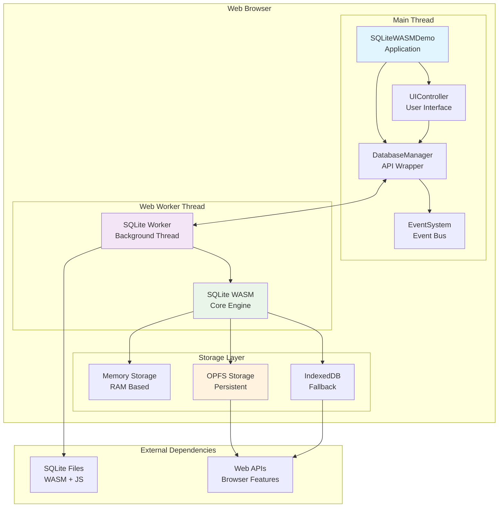

## Sequence Diagram - Database Initialization

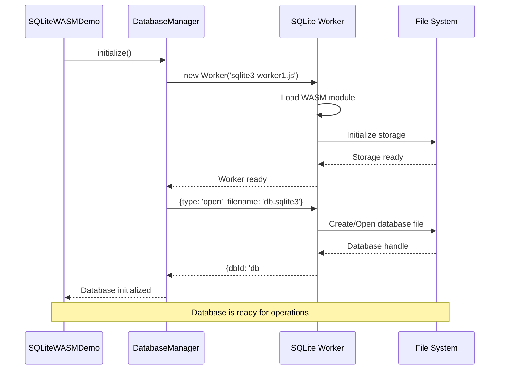

## Sequence Diagram - SQL Execution

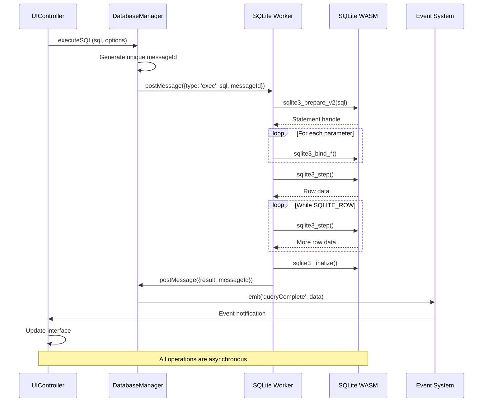

## State Diagram - DatabaseManager States

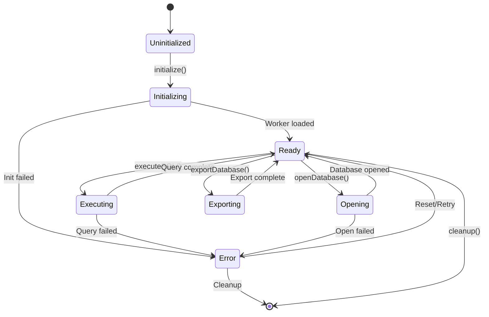

## Class Diagram - Detailed API Structure

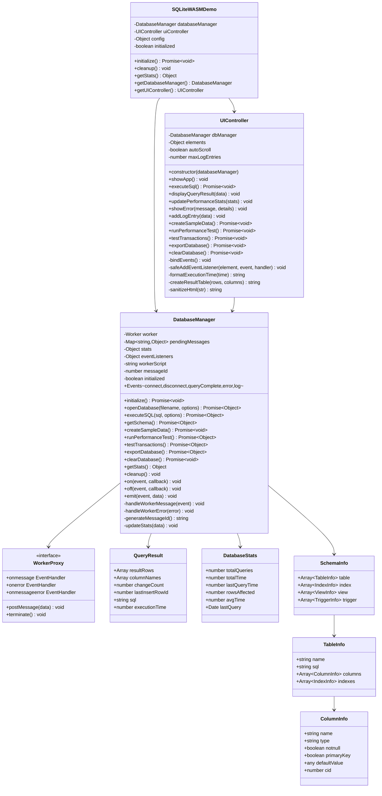

## Activity Diagram - Query Execution Flow

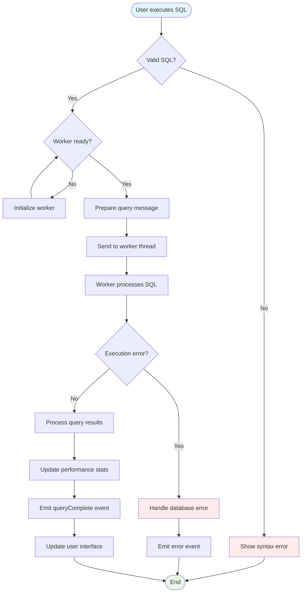

## Deployment Diagram

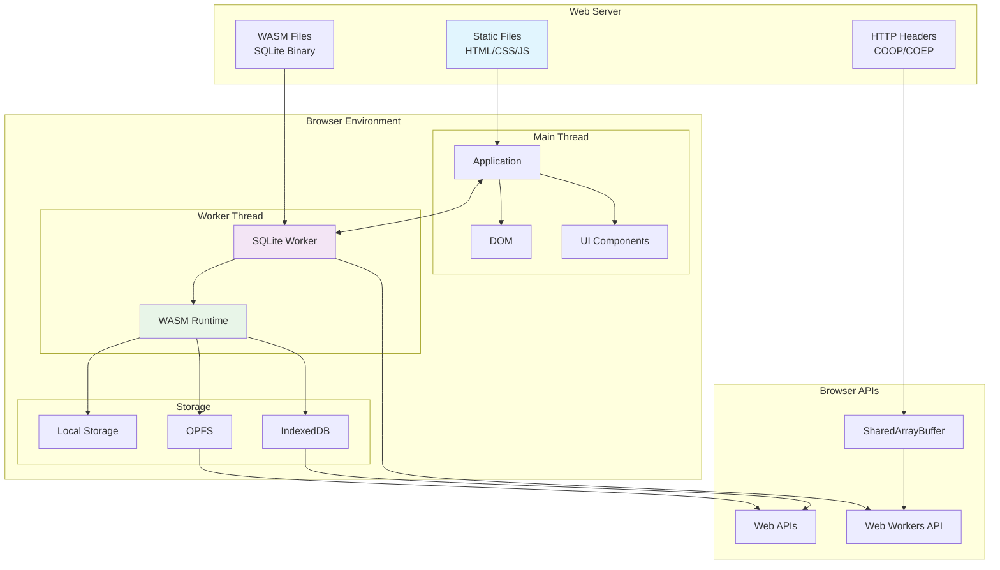

## Package Diagram - File Structure

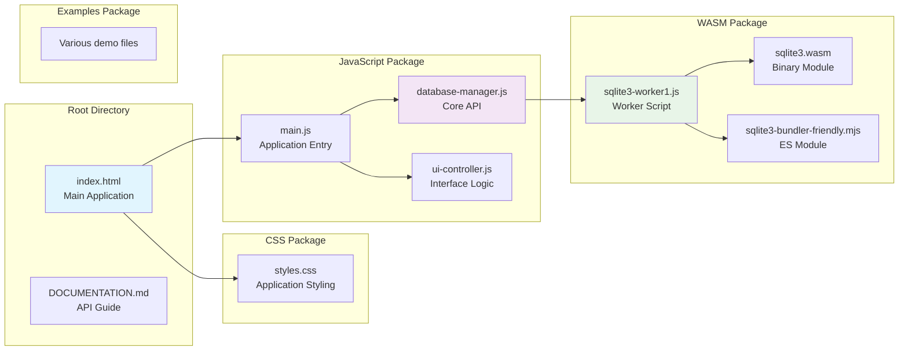

## Entity Relationship Diagram - Sample Data Model

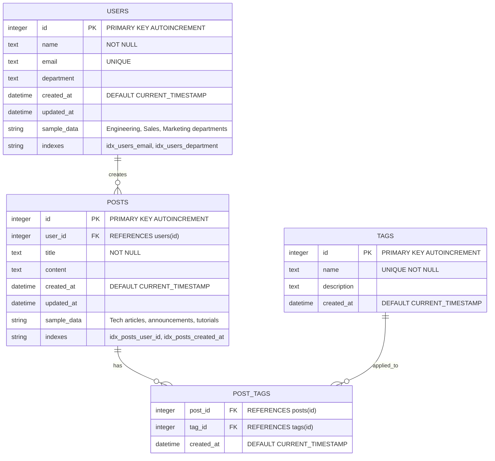

## Network Sequence Diagram - File Loading

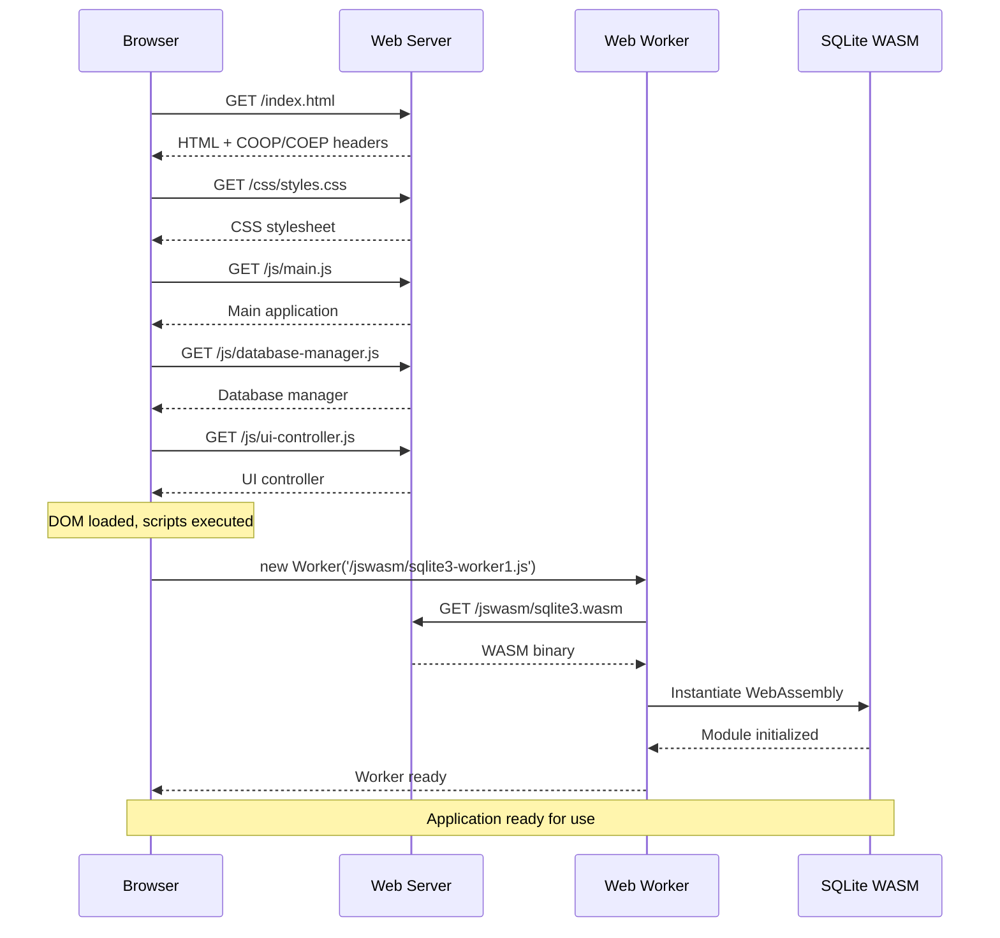

## Performance Flow Diagram

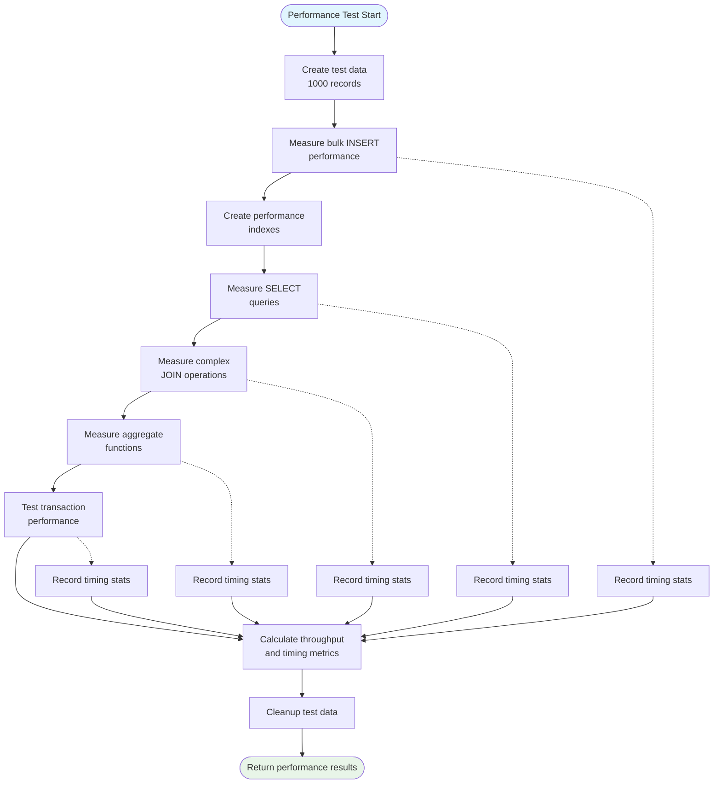

---

## Legend

-   **Components**: Major functional units
-   **Sequences**: Time-ordered interactions
-   **States**: System state transitions
-   **Classes**: Object-oriented structure
-   **Activities**: Process workflows
-   **Deployment**: Runtime environment
-   **Packages**: Code organization
-   **Entities**: Data relationships
-   **Performance**: Benchmark workflows

These diagrams provide a comprehensive view of the SQLite WASM architecture, API design, and usage patterns for developers integrating with the system.
